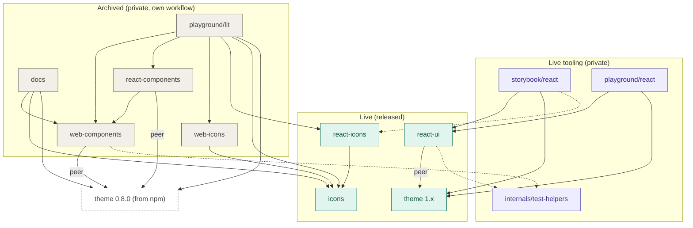
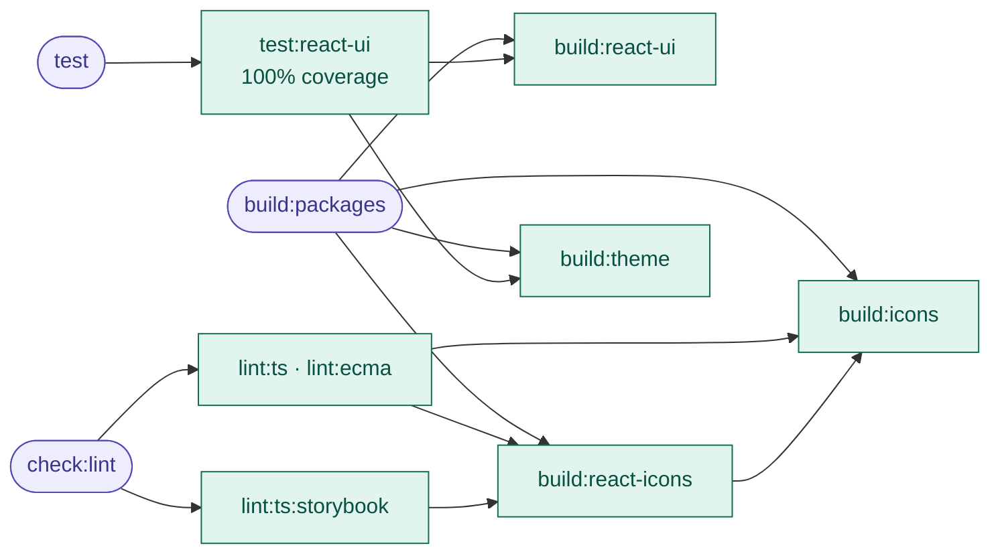
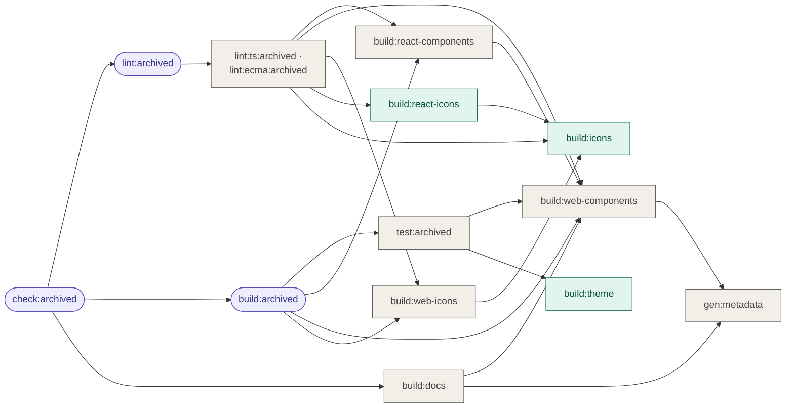
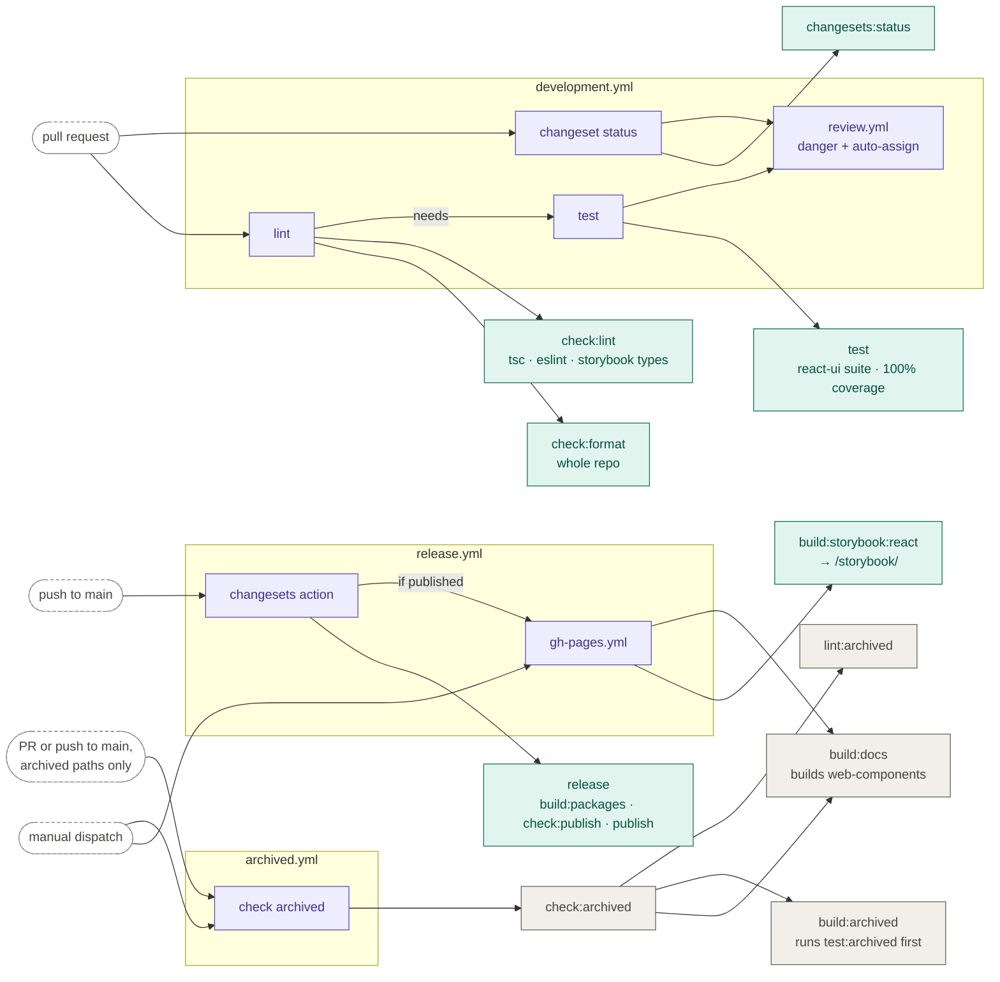

# Contributing to Tapsi Design System's Monorepo

If you're reading this, you're definitely awesome! <br /> The following is a set
of guidelines for contributing to Tapsi Design System's Monorepo, which are
hosted in the
[Tapsi Design System's Monorepo](https://github.com/Tap30/web-components). These
are mostly guidelines, not rules. Use your best judgment, and feel free to
propose changes to this document in a pull request.

## Code of Conduct

This project and everyone participating in it is governed by the
[Code of Conduct](https://github.com/Tap30/web-components/blob/main/CODE_OF_CONDUCT.md).
By participating, you are expected to uphold this code.

## A large spectrum of contributions

There are many ways to contribute, code contribution is one aspect of it. For
instance, documentation improvements are as important as code changes.

## Your first Pull Request

Working on your first Pull Request? You can learn how from this free video
series:

[How to Contribute to an Open Source Project on GitHub](https://egghead.io/courses/how-to-contribute-to-an-open-source-project-on-github)

To help you get your feet wet and get you familiar with our contribution
process, we have a list of
[good first issues](https://github.com/Tap30/web-components/issues?q=is:open+is:issue+label:"good+first+issue")
that contain changes that have a relatively limited scope. This label means that
there is already a working solution to the issue in the discussion section.
Therefore, it is a great place to get started.

We also have a list of
[good to take issues](https://github.com/Tap30/web-components/issues?q=is:open+is:issue+label:"good+to+take").
This label is set when there has been already some discussion about the solution
and it is clear in which direction to go. These issues are good for developers
that want to reduce the chance of going down a rabbit hole.

You can also work on any other issue you choose to. The "good first" and "good
to take" issues are just issues where we have a clear picture about scope and
timeline. Pull requests working on other issues or completely new problems may
take a bit longer to review when they don't fit into our current development
cycle.

If you decide to fix an issue, please be sure to check the comment thread in
case somebody is already working on a fix. If nobody is working on it at the
moment, please leave a comment stating that you have started to work on it so
other people don't accidentally duplicate your effort.

If somebody claims an issue but doesn't follow up for more than a week, it's
fine to take it over but you should still leave a comment. If there has been no
activity on the issue for 7 to 14 days, it is safe to assume that nobody is
working on it.

## Sending a Pull Request

Pull Requests are always welcome, but, before working on a large change, it is
best to open an issue first to discuss it with the maintainers.

When in doubt, keep your Pull Requests small. To give a Pull Request the best
chance of getting accepted, don't bundle more than one feature or bug fix per
Pull Request. It's often best to create two smaller Pull Requests than one big
one.

1. Fork the repository.

2. Clone the fork to your local machine and add upstream remote:

```sh
git clone https://github.com/<your username>/web-components.git
cd web-components
git remote add upstream https://github.com/Tap30/web-components.git
```

3. Synchronize your local `main` branch with the upstream one:

```sh
git checkout main
git pull upstream main
```

4. Sync and install the engines using
   [Corepack](https://pnpm.io/installation#using-corepack) or
   [Volta](https://volta.sh/)

5. Install the dependencies with `pnpm` (`npm` and `yarn` aren't supported):

```sh
pnpm install
```

6. Create a new topic branch:

```sh
git switch -c my-topic-branch
```

7. Make changes, commit and push to your fork:

```sh
git push -u origin HEAD
```

8. Go to [the repository](https://github.com/Tap30/web-components) and make a
   Pull Request.

The core team is monitoring for Pull Requests. We will review your Pull Request
and either merge it, request changes to it, or close it with an explanation.

### Development server

Start developing server and watch for code changes:

```sh
pnpm dev
```

`pnpm dev` starts the live track (see
[How the repository fits together](#how-the-repository-fits-together)): the
React playground on port 5174 and Storybook on port 6006, side by side. Stopping
either one stops both.

There are two playgrounds, one per generation of the design system, because they
are styled by different token sets and cannot share a page:

- **`playground/lit`** (port 5173) — the **archived** `@tapsioss/web-components`
  and `@tapsioss/react-components`. Edit `playground/lit/src/index.ts` (for
  native stuffs) or `playground/lit/src/react-root.tsx` (for React stuffs), and
  `playground/lit/index.html` to use your registered web components. It pins
  `@tapsioss/theme` to the published **`0.8.0`**, the pre-1.0 token set these
  components are styled against.
- **`playground/react`** (`pnpm dev:react`, port 5174) — `@tapsioss/react-ui`.
  Edit `playground/react/src/index.tsx`. It uses the workspace `@tapsioss/theme`
  (1.x). Its dev server reads react-ui straight from `packages/react-ui/src`, so
  a change to a component or its CSS shows up immediately — there is nothing to
  build or watch.

Both name the _same_ package at different versions; pnpm gives each its own
`node_modules`, and each playground's `tsconfig.json` sets `"paths": {}` so the
root's source aliases cannot override the pin. Add or change a dependency in a
playground's `package.json` and that is what it gets — nothing else to update.

Because `paths` is empty, a playground otherwise resolves packages through their
`exports` map, i.e. their **built output**: the Lit playground always, and the
React playground's production build (`vite build`), which is what the react-ui
tests and their coverage run against.

The archived track has no dev scripts. To work on it, run `pnpm build:archived`,
then start the Lit playground with
`pnpm --filter @tapsioss/lit-playground run start:dev`; rebuild after each
change.

### Dev scripts

| Command                     | Runs                                           |
| --------------------------- | ---------------------------------------------- |
| `pnpm dev`                  | same as `dev:react`                            |
| `pnpm dev:react`            | the react playground + Storybook (from source) |
| `pnpm dev:playground:react` | the react playground alone                     |
| `pnpm storybook:react`      | Storybook, port 6006                           |

Note that `packages/theme` has **no** `dev` script — there is nothing to watch —
so a token change needs `pnpm --filter @tapsioss/theme run build` before a
playground sees it — the React playground included, which reads only react-ui
from source. Storybook reads the theme from source and does not.

### Building

You can build the live packages, including all type definitions, with:

```sh
pnpm build:packages
```

### Testing

To run the tests of the live packages (`@tapsioss/react-ui`), run:

```sh
pnpm test
```

`@tapsioss/react-ui` must stay **100% covered** by its tests. `pnpm test` (and
the CI test job) fails below that, even when every test passes. The console
shows which lines are uncovered; open `packages/react-ui/coverage/index.html`
for the details.

The archived packages have their own commands, and their own CI workflow:

```sh
pnpm check:archived   # lint, test, build and docs build for the archived track
pnpm test:archived    # just the web-components Playwright suite
```

### Coding style

Please follow the coding style of the project. We use `prettier` and `eslint`,
so if possible, enable linting in your editor to get real-time feedback.

### Git Commit Messages

- Use the present tense ("Add feature" not "Added feature")
- Use the imperative mood ("Move cursor to..." not "Moves cursor to...")
- Limit the first line to 72 characters or less
- Reference issues and pull requests liberally after the first line
- Please use the following commit message conventions for consistent and
  informative commit history:
  - **feat**: A new feature
  - **fix**: A bug fix
  - **docs**: Documentation only changes
  - **style**: Changes that do not affect the meaning of the code (white-space,
    formatting, missing semi-colons, etc)
  - **refactor**: A code change that neither fixes a bug nor adds a feature
  - **perf**: A code change that improves performance
  - **test**: Adding missing or correcting existing tests
  - **build**: Changes that affect the build system or external dependencies
    (example scopes: gulp, broccoli, npm)
  - **ci**: Changes to our CI configuration files and scripts (example scopes:
    Travis, Circle, BrowserStack, SauceLabs)
  - **chore**: Other changes that don't modify src or test files
  - **revert**: Reverts a previous commit

## How the repository fits together

The repository holds two generations of the design system:

- **Live** — `@tapsioss/theme` (1.x), `@tapsioss/icons`, `@tapsioss/react-icons`
  and `@tapsioss/react-ui`. These are released, and they are what the main
  scripts (`build:packages`, `test`, `check:lint`, `dev`) and the main CI
  workflow cover.
- **Archived** — `@tapsioss/web-components`, `@tapsioss/react-components` and
  `@tapsioss/web-icons`, plus their consumers `playground/lit` and `docs`. These
  are private and no longer released, but still maintained: everything about
  them runs under `pnpm check:archived` and the `archived.yml` workflow.

### Package dependencies

Arrows point from a package to what it depends on. Solid arrows are
dependencies, dotted arrows are dev dependencies.



Worth knowing:

- The archived track never touches the workspace theme. It uses `0.8.0` from
  npm, so changing `packages/theme` cannot break it.
- The archived track _does_ depend on live packages (`icons`, `react-icons`) and
  shares `internals/test-helpers` with `react-ui`. Changing any of these also
  runs the archived workflow.
- `react-ui` does not depend on `react-icons`, and its tests must not either.
  Only Storybook (for the icon gallery) does.

### Build orchestration (wireit)

Root scripts are [wireit](https://github.com/google/wireit) tasks: each declares
the tasks that must finish before it, and wireit runs them in that order (in
parallel where it can) and skips any whose inputs have not changed since the
last run. Arrows point at what runs first. Rectangles run a command; rounded
nodes only group other tasks. `check:format` and `format` (Prettier) have no
dependencies and are left out.

Main scripts:



Archived scripts — teal nodes are the live builds they share:



Worth knowing:

- No main script reaches an archived task. The crossing goes the other way:
  archived tasks build `icons`, `react-icons` and `theme`, which they share with
  the live packages.
- `build:react-ui` has no dependencies — not even `build:theme`. react-ui reads
  theme tokens as CSS variables at runtime, so only its tests (which load the
  theme's stylesheets) need the theme built.
- A task is only re-run when one of its `files` changed. If a build looks stale,
  `pnpm clear:cache` forgets every recorded run.

### CI workflows

Which event starts which workflow, and which root scripts each one runs.



Worth knowing:

- `archived.yml` runs only when an archived directory, a package it depends on,
  `internals/test-helpers` or root configuration changes.
- The Pages deploy builds `docs`, which builds `web-components`, so a broken
  archive also breaks the deploy that follows a release.
- `release.yml` runs on every push to `main` and does not wait for the other
  workflows; it relies on branch protection having required them on the PR.

When you change a dependency, a script or a workflow, update these diagrams in
the same pull request.

## License

By contributing your code to the `Tap30/*` GitHub repositories, you agree to
license your contribution under the
[MIT license](https://github.com/Tap30/web-components/blob/main/LICENSE).
