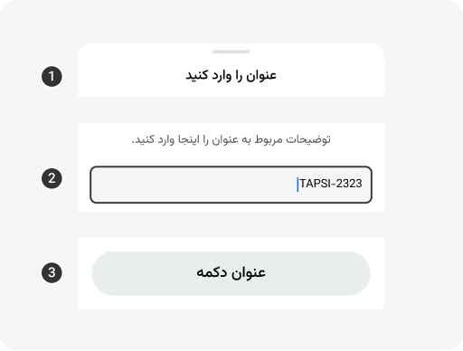
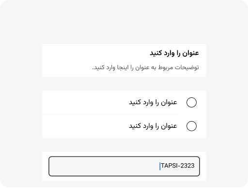
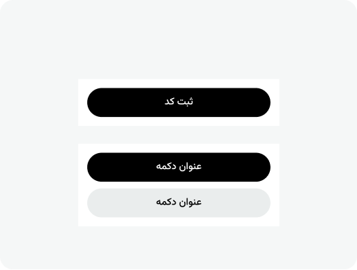
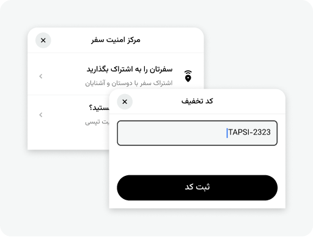
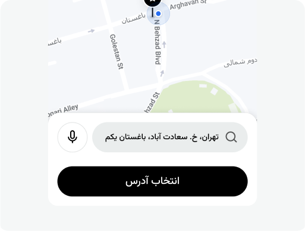
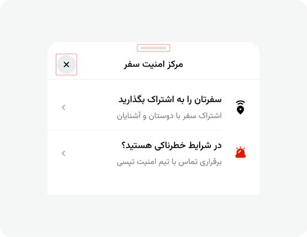
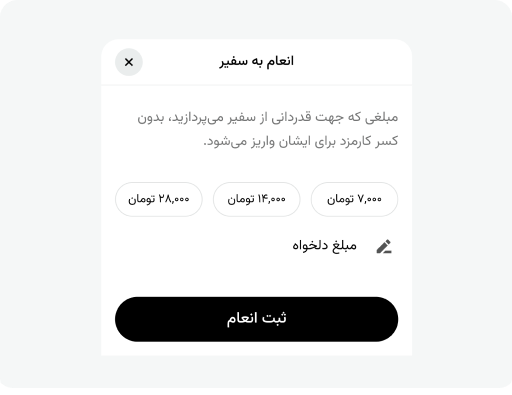
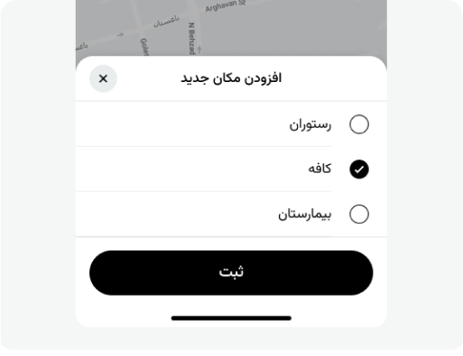

# Bottom Sheet

<doc-guideline-section>

  
### Anatomy

Every Bottomsheet consist of 3 sections

- Title
- Content
- Action Bar

Each part has a specific role and should contain content that serves that role.  
The bottom sheet should be draggable to expand and reveal more details or actions when needed, with an option to collapse it again.

</doc-guideline-section>

<doc-guideline-section>

#### Title

The title section defines the purpose of the bottom sheet. It may include elements such as an artwork, title, and description. Additionally, it can feature leading and trailing icons, often used for navigation actions like "back" or "close."

- Use Handler when you expect users to interact more deeply with the content, such as scrolling, expanding, or manipulating the sheet.
- For more static interactions where you want users to focus on reading information or completing an action without needing to manipulate the interface it’s ok to not using handler.

</doc-guideline-section>

<doc-guideline-section>

#### Content

The content section mostly consist of description texts, inputs, and selections

</doc-guideline-section>

<doc-guideline-section>

#### Action Bar

This section is consist of button elements that can be vary from single button to multiple vertical and horizontal buttons

</doc-guideline-section>

<doc-guideline-section>

### Types of BottomSheet
All the bottomsheets are in this 2 category

- **Selective**: Allows users to select one or multiple options to proceed.
- **Data-Based**: Requires users to input data.

</doc-guideline-section>

<doc-guideline-section>

### Spec

- Width: Full Width of the screen
- Background Color: `color-surface-primary`
- Top left radius: `radius-20px`
- Top right radius: `radius-20px`
- Direction: Vertical
- Item spacing: `spacing-16px`
- Padding Top: `spacing-16px`
- Padding Bottom: `spacing-32px`

</doc-guideline-section>

<doc-row>

<doc-guideline-card variant="do">

Avoid using both handler and close icon at the same time

</doc-guideline-card>
  
<doc-guideline-card variant="dont">

On the map, the bottom sheet should only cover a portion of the screen, such as the lower third, allowing the map to remain visible.

</doc-guideline-card>

</doc-row>

<doc-row>

<doc-guideline-card variant="do">

Bottom sheets that require confirmation from users should include an action bar.

</doc-guideline-card>

<doc-guideline-card variant="dont">

Selective bottom sheets with a single option do not require an action bar.

</doc-guideline-card>

</doc-row>

<doc-guideline-section>

<doc-guideline-card slot="image" variant="caution">

Avoid stacking two layers of bottom sheets or modals on top of each other. If necessary, ensure a close option is provided for the previous layer.

</doc-guideline-card>

Avoid stacking two layers of bottom sheets or modals on top of each other.

Make sure that both bottom sheets have easily accessible and visible close buttons. The user should be able to quickly exit the top sheet first, and then the bottom sheet.

If it's crucial that the user interacts with one sheet before the other, make the second sheet modal. make sure the second option has a close option

</doc-guideline-section>

